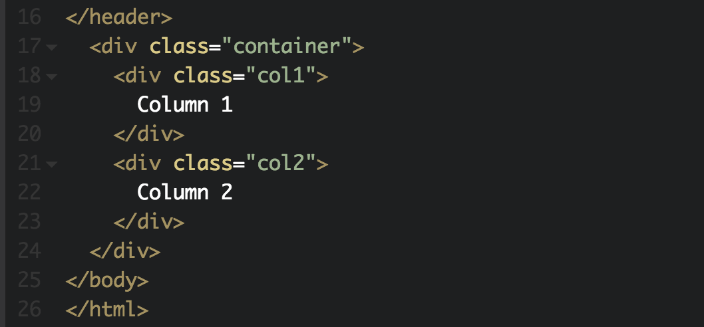

# 📌 CAPSTONE PROJECT: WEEK 1, DAY 2.

# DO NOW 🔊

1.  BE QUIET
2.  GIVE YOUR INSTRUCTOR YOUR ATTENTION
3.  OPEN **CODEPEN.IO** AND SIGN IN
4.  OPEN **https://github.com/ECS-CS/html** IN ANOTHER TAB THEN CLICK **Y1-Q4-Capstone** THEN **Week1Day2.md**
5.  YOU SHOULD ALWAYS HAVE AT LEAST TWO TABS OPENED

# FORKING

1.  After logging into CodePen
2.  Click the profile icon in the top right and go to **Your Profile**
3.  Click your Capstone Project, rename it to **CAPSTONE PROJECT** (ALL CAPS)
4.  Then, **FORK** this project and rename the new version to **CAPSTONE PROJECT 2** (ALL CAPS)
5.  The reason we do this is to ALWAYS have a fresh copy of our previous work just incase we make a mistake.

# HOUSE KEEPING

1.  After opening **CAPSTONE PROJECT 2**
2.  Click **Settings**, in the toolbar
    
3.  Click **Behavior** and then in **Auto-Updating Preview** section:
    
4.  Uncheck **ENABLED**

# HTML (10 MINS)

## STEP 1:

**Updating our previous HTML structure:**

Let's add a **class** with a value of **header** to the first div, after the opening `<header>` tag, but **BEFORE** the opening `<nav>` tag.

```html
<div>Mr. Bostwick's Blog</div>
```

**becomes**

```html
<div class="header">Mr. Bostwick's Blog</div>
```

## STEP 2:

In the CSS section of CodePen lets change **div** to **.header**.


## STEP 3:

We are going to focus on the body of our webpage by creating two equally sized columns.

Let's copy and paste the below code **after** the closing `</header>` tag but **BEFORE** the closing `</body>` tag.

```html
  <div class="container">
    <div class="col1">
      Column 1
    </div>
    <div class="col2">
      Column 2
    </div>
  </div>
```

## STEP 4:

We are going to embed our Scratch Capstone Project into our webpage.

1.  Let's open https://phosphorus.github.io/ in a New Tab. **(right click, Open Link in New Tab)**
2.  Sign into your Scratch Account: https://scratch.mit.edu/
3.  Go to the **project page** of your Scratch Capstone Project.
4.  **COPY** the **WHOLE** URL from the URL bar.

## (ex: https://scratch.mit.edu/projects/[YOUR-PROJECT-ID]/)

5.  Insert your **YOUR PROJECT** url into the box below:
    
6.  Once the new page loads, **copy** the text in the box below:
    
7.  Go back to **CodePen** and replace the "Column 1" text with the script tags you copied.
    
8.  After replacing "Column 1" your **CodePen** should look similar to this:
    

# CSS (1 MIN)

## STEP 1:

We are going to style the columns we created above using the code below.

Let's copy and paste the code below in the CSS section of CodePen below what we currently have.

```css
/* GRID */

.container {
  display: grid;
  grid-template-columns: 1fr 1fr;
  grid-gap: 10px;
  margin-top: 10px;
}

.col1,
.col2 {
  height: 400px;
  border: 1px solid black;
  text-align: center;
  padding: 10px;
  overflow: hidden;
}
```

# 🚨🚨 HOMEWORK 🚨🚨

## To receive full credit for this part of your Capstone Project, you will have to do the following:

## HTML CHANGES

(These changes will be made in the **HTML section of CodePen**)

1.  Embed your capstone project into the left column (Column #1).
2.  Insert `<p></p>` tags into the right column (Column #2).
3.  Inside the `<p></p>` tags describe your Scratch Project. (Minimum of 3 sentences)
4.  Insert a header tag **ABOVE** the `<p></p>` tags you created and insert text between them. (ex: `<h1></h1>` or `<h2></h2>`).

## CSS CHANGES

(These changes will be made in the **CSS section of CodePen**)

5.  Target the `<p>` tag you created in #2, and style it. (ex: Change the font size, color, font-weight, text-align, etc..)
6.  Target the header tag you created in #4 and style it.

# FINISHED CODE

If for any reason you lose your code, or came late to class, absent or (anything else you can think of that kept you from completing this lesson), you can **FORK** this pen to create a copy to your account.

Any other words, this is your **starting point** before you complete your deliverables.

## https://codepen.io/GainorB/pen/xjQPKZ

## 🚨 MAKE SURE YOU SAVE AND SIGN OUT 🚨

# LEARNING RESOURCES

1.  Learn HTML: https://www.w3schools.com/html/default.asp
2.  Learn CSS: https://www.w3schools.com/css/default.asp

# EXTENDED CLASS HOURS

## If for any reason you need more time to work on an assignment, we are available to work with you directly during lunch or after school until 6PM.

# MAC KEYBOARD SHORTCUTS

1.  CMD + C: copy
2.  CMD + V: paste
3.  CMD + X: cut
4.  CMD + A: select all
5.  CMD + Z: undo
