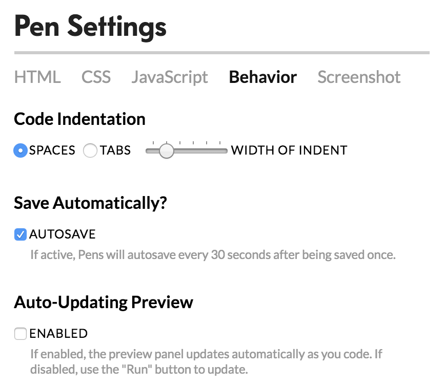

# 📌 CAPSTONE PROJECT: WEEK 2, DAY 1.

# DO NOW 🔊

1.  BE QUIET
2.  GIVE YOUR INSTRUCTOR YOUR ATTENTION
3.  OPEN **CODEPEN.IO** AND SIGN IN
4.  OPEN **https://github.com/ECS-CS/html** IN ANOTHER TAB THEN CLICK **Y1-Q4-Capstone** THEN **Week2Day1.md**
5.  YOU SHOULD ALWAYS HAVE AT LEAST TWO TABS OPENED

# FORKING

1.  After logging into CodePen
2.  Click the profile icon in the top right and go to **Your Profile**
3.  Click **CAPSTONE PROJECT 2**
4.  Then, **FORK** this project and rename the new version to **CAPSTONE PROJECT 3** (ALL CAPS)
5.  The reason we do this is to ALWAYS have a fresh copy of our previous work just incase we make a mistake.

# HOUSE KEEPING

1.  After opening **CAPSTONE PROJECT 3**
2.  Click **Settings**, in the toolbar
    
3.  Click **Behavior** and then in **Auto-Updating Preview** section:
    
4.  Uncheck **ENABLED**

# HTML (10 MINS)

## Functional Navigational Links

Today's lesson will focus on this section:

```html
  <nav>
    <ul>
      <li>Home</li>
      <li>About</li>
      <li>Projects</li>
      <li>Contact Me</li>
    </ul>
  </nav>
```

## STEP 1:

Each `<li>.....</li>` element has to be updated to include anchor tags. We will make our links pull our attention to a different part of our webpage.

We will work with this element specifically:

```html
<li>About</li>
```

## STEP 2:

Using the element above, lets surround the **About** text with `<a></a>` tags.

Example:

```html
<li><a>About</a></li>
```

## STEP 3:

Does anyone remember the HTML attribute that is **required** in all anchor tags? Starts with **h** and ends with **f**..................**href**.

Let's add the **href** attribute to our anchor tag, and give it a value of **#home**:

Example:

```html
<li><a href="#about">About</a></li>
```

## STEP 4:

We've successfully added our first link to our nav bar. **BUT** this link doesn't go anywhere. We need to create a new HTML element for it to navigate to.

Our new element:

```html
<div id="about">My Content Goes Here</div>
```

Insert this element after the **LAST** closing `</div>` tag in the **HTML section in CodePen** BUT **before** the closing `</body>` tag.

# 🚨🚨 HOMEWORK 🚨🚨

## To receive full credit for this part of your Capstone Project, you will have to do the following:

## HTML CHANGES

(These changes will be made in the **HTML section of CodePen**)

1.  Insert anchor tags for the rest of your navigational links.

**Questions 2-4 are about this element:**

```html
<div id="about">My Content Goes Here</div>
```

2.  Insert `<p></p>` tags around **My Content Goes Here** in the HTML element we added above.
3.  Change **My Content Goes Here**. This section describes your webpage to your users. Be descriptive and warm: Include text, pictures, videos, etc..
4.  You probably noticed the `<p></p>` tags you added, are already styled. Let's add a class to the `<p></p>` tags. Add **class="myAbout"** to the opening `<p>` tag.

**HINT:**

```html
<div id="about"><p class="....">My Content Goes Here</p></div>
```

## CSS CHANGES

(These changes will be made in the **CSS section of CodePen**)

5.  Target the `.myAbout` class you just created and style it. (ex: font-size, font-weight, color, text-align, etc..)

**HINT:**

```css
.myAbout {
  .......;
}
```

# FINISHED CODE

If for any reason you lose your code, or came late to class, absent or (anything else you can think of that kept you from completing this lesson), you can **FORK** this pen to create a copy to your account.

Any other words, this is your **starting point** before you complete your deliverables.

## https://codepen.io/GainorB/pen/MGRYQW

## 🚨 MAKE SURE YOU SAVE AND SIGN OUT 🚨

# LEARNING RESOURCES

1.  Learn HTML: https://www.w3schools.com/html/default.asp
2.  Learn CSS: https://www.w3schools.com/css/default.asp

# EXTENDED CLASS HOURS

## If for any reason you need more time to work on an assignment, we are available to work with you directly during lunch or after school until 6PM.

# MAC KEYBOARD SHORTCUTS

1.  CMD + C: copy
2.  CMD + V: paste
3.  CMD + X: cut
4.  CMD + A: select all
5.  CMD + Z: undo
